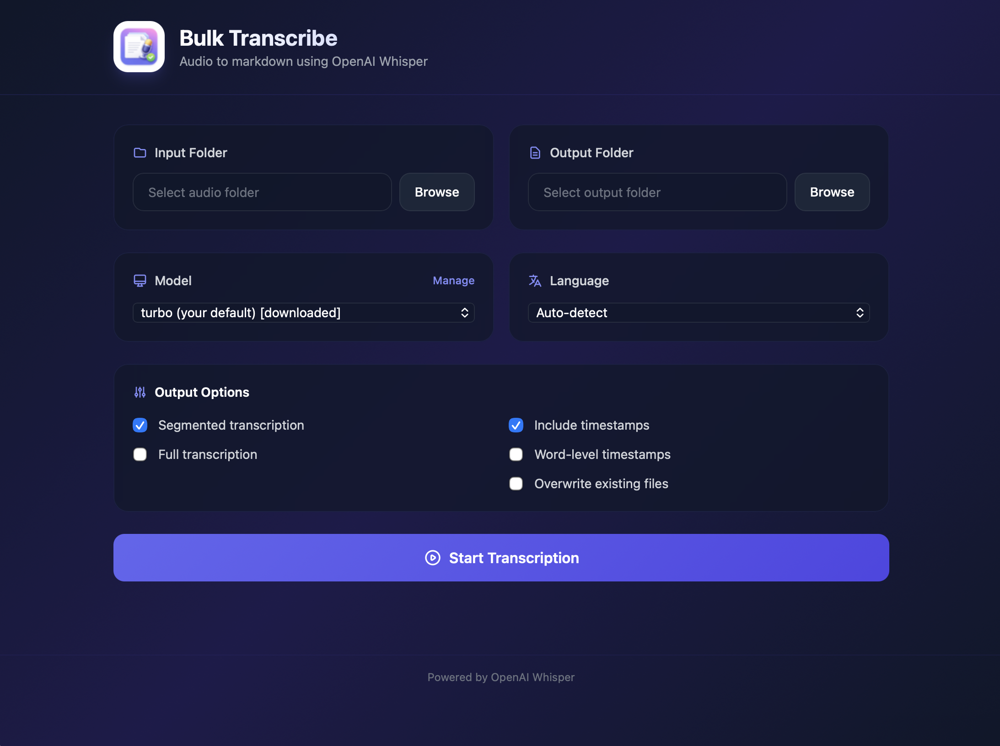

# Bulk Transcribe

<p align="center">
  
</p>

A native macOS app for batch transcribing audio files to markdown using OpenAI Whisper. Features a native app window, real-time progress tracking, and flexible output options.

## Features

- **Native macOS App** - Runs in its own window, no browser required
- **Batch Processing** - Transcribe entire folders of audio files
- **Skip Existing Files** - Resume interrupted jobs without re-transcribing
- **Multiple Formats** - MP3, WAV, M4A, FLAC, OGG, WebM, MP4, MOV, AVI
- **Model Management** - Download, delete, and switch between Whisper models
- **Smart Defaults** - Turbo model recommended for best speed/quality balance
- **Language Support** - Auto-detect or specify from 12+ languages
- **Flexible Output** - Segmented, full text, or both with optional timestamps
- **Real-time Progress** - Per-file progress bar with percentage
- **Persistent Settings** - Folder selections and preferences saved across sessions
- **Cancel Support** - Immediately stops transcription

## Screenshots

### Main Interface
<p align="center">
  
</p>

## Installation

### Option 1: Download DMG (Recommended)

1. Download `Bulk Transcribe.dmg` from the [releases](https://github.com/lukefind/bulk-transcribe/releases)
2. Open the DMG and drag `Bulk Transcribe.app` to Applications
3. Double-click to launch

**This is a fully self-contained app** - no additional installation required.

### Option 2: Build from Source

```bash
# Clone the repository
git clone https://github.com/lukefind/bulk-transcribe.git
cd bulk-transcribe

# Create virtual environment and install dependencies
python3 -m venv venv
./venv/bin/pip install -r requirements.txt

# Build the app
./venv/bin/python -m PyInstaller --clean --noconfirm whisper_app.spec

# Create DMG (optional)
hdiutil create -volname "Bulk Transcribe" -srcfolder "dist/Bulk Transcribe.app" -ov -format UDZO "dist/Bulk Transcribe.dmg"
```

## Usage

1. Launch **Bulk Transcribe.app**
2. Click **Browse** to select your input folder (containing audio files)
3. Click **Browse** to select your output folder
4. Choose model, language, and output options
5. Click **Start Transcription**

### Skip Existing Files

By default, files that already have a `_transcription.md` output are skipped. This allows you to resume interrupted jobs. Check **Overwrite existing files** to re-transcribe all files.

## Models

| Model | Speed | Accuracy | RAM | Recommendation |
|-------|-------|----------|-----|----------------|
| tiny | Fastest | Basic | ~1 GB | Quick tests |
| base | Fast | Good | ~1 GB | Light usage |
| small | Balanced | Better | ~2 GB | General use |
| medium | Slow | High | ~5 GB | Better quality |
| large | Slowest | Best | ~10 GB | Best quality |
| **turbo** | **Fast** | **Good** | **~6 GB** | **Recommended** |

## Output Options

- **Segmented Transcription** - Timestamped segments (HH:MM:SS format)
- **Full Transcription** - Complete text block
- **Include Timestamps** - Show start/end times for segments
- **Word-level Timestamps** - Detailed per-word timing (slower)
- **Overwrite existing files** - Re-transcribe files that already have output

## System Requirements

- **macOS** 10.15 (Catalina) or later
- **RAM** 4GB minimum, 8GB+ recommended
- **Storage** ~500MB for app, plus model cache

## Documentation

- [User Guide](USER_GUIDE.md) - Detailed usage instructions and tips

## Privacy

All processing happens locally on your Mac. No audio is sent to external servers.

## License

MIT License
